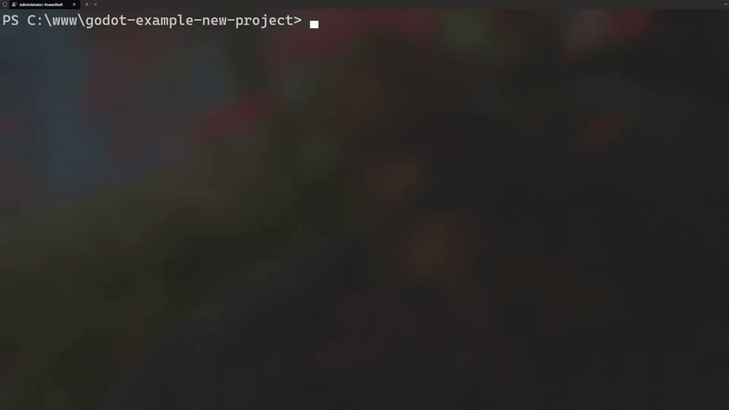

**Description:**

Initializes a new Godot project by setting up the necessary folder structure and configuration files. It prompts the user for the project name and the desired Godot version.

**Usage:**

```bash
gdcli init
```



**Behavior:**

- Checks if a `gdproj.json` configuration file already exists in the current directory. If it does, the tool informs the user that the project is already initialized and suggests running `gdcli install` to install dependencies.

- Prompts the user to input the project name (defaulting to the current directory name) and to select a Godot version from a list.

- Creates a `gdproj.json` configuration file with the selected settings.

- Downloads and installs the specified Godot version.

- Generates a `project.godot` file with basic configurations.

- Updates the `.gitignore` file to exclude specific directories and files related to Godot and gdcli.

**Example:**

```bash
$ gdcli init
Project name: MyGodotGame
Select Godot version: [Choose from list]
Installing Godot [version]...
Launching Godot editor...
```
