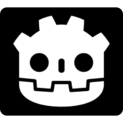

# gdcli (Godot Project CLI)

gdcli is a command-line interface tool designed to streamline the creation and management of Godot projects. Inspired by npm, it offers functionalities to initialize projects, manage Godot versions, and more.

## Features

- **Initialize Projects**: Set up a new Godot project with a ready-to-use folder structure.
- **Install project dependencies**: Automatically handle the appropriate Godot version for your projects.
- **Open Projects**: Launch your project in the Godot editor effortlessly.

For detailed command usage, refer to the [Commands](commands/init.md) section.
